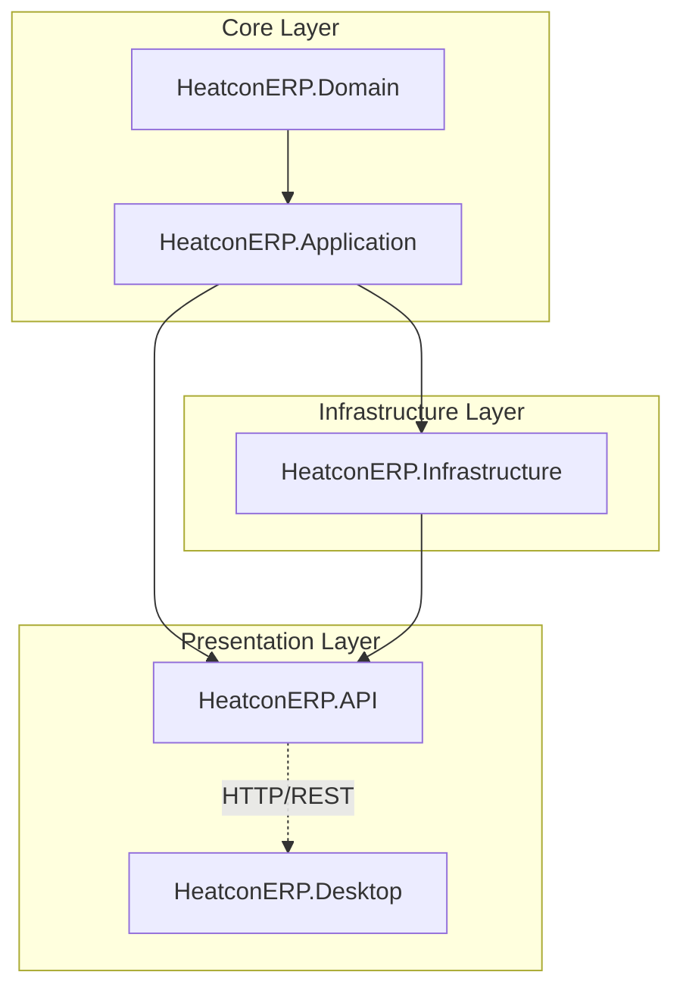
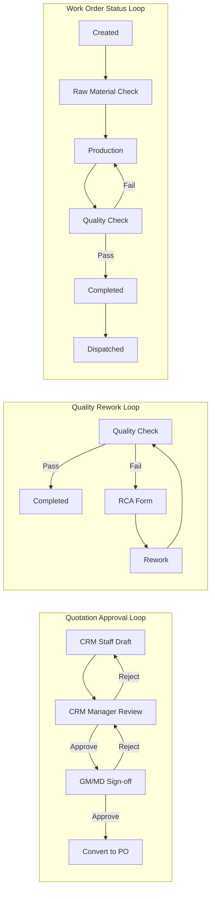

# HeatconERP Initial Solution Structure Plan

## Architecture Overview




**Dependency Flow:**

- **Domain**: No dependencies (pure entities, interfaces)
- **Application**: References Domain only
- **Infrastructure**: References Application + Domain
- **API**: References Application + Infrastructure
- **Desktop**: References nothing (standalone WPF app, calls API via `HttpClient`)

---

## 1. Solution and Project Creation

### Create Solution File

- **File**: `HeatconERP.sln` at root
- Create solution with `dotnet new sln -n HeatconERP`

### Create Projects (in order)


| Project                   | Type          | Path                                                             |
| ------------------------- | ------------- | ---------------------------------------------------------------- |
| HeatconERP.Domain         | Class Library | `src/HeatconERP.Domain/HeatconERP.Domain.csproj`                 |
| HeatconERP.Application    | Class Library | `src/HeatconERP.Application/HeatconERP.Application.csproj`       |
| HeatconERP.Infrastructure | Class Library | `src/HeatconERP.Infrastructure/HeatconERP.Infrastructure.csproj` |
| HeatconERP.API            | Web API       | `src/HeatconERP.API/HeatconERP.API.csproj`                       |
| HeatconERP.Desktop        | WPF App       | `src/HeatconERP.Desktop/HeatconERP.Desktop.csproj`               |


### Add Project References

- Add all projects to solution
- Application → Domain
- Infrastructure → Application
- API → Application, Infrastructure
- Desktop → (none)

---

## 2. Domain Project (`HeatconERP.Domain`)

**Target Framework**: `net8.0`  
**Dependencies**: None

### User Roles (Enum)

**File**: `src/HeatconERP.Domain/Enums/UserRole.cs`

```csharp
namespace HeatconERP.Domain.Enums;

public enum UserRole
{
    MD,                    // Managing Director
    GM,                    // General Manager
    FrontOffice,           // Front Office
    CRMManager,            // CRM Manager
    CRMStaff,              // CRM Staff
    ProductionManager,     // Production Manager
    ProductionStaff,       // Production Staff
    QualityCheck,          // Quality Check
    DispatchStoreManager   // Dispatch / Store Manager
}
```

### User Entity

**File**: `src/HeatconERP.Domain/Entities/User.cs`

```csharp
namespace HeatconERP.Domain.Entities;

public class User
{
    public Guid Id { get; set; }
    public string Username { get; set; } = string.Empty;
    public string PasswordHash { get; set; } = string.Empty;
    public UserRole Role { get; set; }  // Use enum instead of string
}
```

### Role Entity (Optional - for RBAC flexibility)

If you need multiple roles per user or role metadata later, add a `Role` entity with FK from `User`. For initial structure, `UserRole` enum on `User` is sufficient.

### Folder Structure

```
HeatconERP.Domain/
├── Entities/
│   └── User.cs
├── Enums/
│   └── UserRole.cs
└── HeatconERP.Domain.csproj
```

---

## 2a. Workflow Loops and Role Matrix

### Approval / Escalation Loops




### Role Hierarchy and Escalation

- **MD**: Final approval on high-value quotations, RCA sign-off, override authority
- **GM**: Quotation approval, escalation from managers, operational oversight
- **CRM Manager**: Approve CRM staff work, escalate to GM when needed
- **Production Manager**: Approve production staff work, assign/reassign WO, escalate QC issues
- **Dispatch/Store Manager**: Inventory, GRN, dispatch; escalate stock shortages

### Role Permission Matrix (High-Level)


| Module          | MD      | GM      | FrontOffice | CRMManager   | CRMStaff | ProdManager | ProdStaff | QualityCheck | DispatchStore |
| --------------- | ------- | ------- | ----------- | ------------ | -------- | ----------- | --------- | ------------ | ------------- |
| Enquiries       | R       | R       | CRUD        | CRUD         | CRUD     | -           | -         | -            | -             |
| Quotations      | Approve | Approve | View        | CRUD+Approve | CRUD     | -           | -         | -            | -             |
| Purchase Orders | R       | R       | -           | CRUD         | CRUD     | View        | -         | -            | View          |
| Work Orders     | R       | R       | -           | View         | -        | CRUD        | Update    | View         | View          |
| Production      | -       | R       | -           | -            | -        | CRUD        | Update    | -            | -             |
| Quality/RCA     | Approve | Approve | -           | -            | -        | View        | -         | CRUD         | -             |
| Inventory       | R       | R       | -           | -            | -        | View        | -         | -            | CRUD          |
| Vendors         | R       | R       | -           | -            | -        | -           | -         | -            | CRUD          |


R = Read/Report; CRUD = Create, Read, Update, Delete

---

## 3. Application Project (`HeatconERP.Application`)

**Target Framework**: `net8.0`  
**References**: HeatconERP.Domain

- Initially minimal: just the project reference and empty `AssemblyInfo` or placeholder
- No CQRS/MediatR required for initial structure; can be added later
- Folder: `src/HeatconERP.Application/` with `.csproj` only for now (or a minimal `DependencyInjection.cs` if desired)

---

## 4. Infrastructure Project (`HeatconERP.Infrastructure`)

**Target Framework**: `net8.0`  
**References**: HeatconERP.Application, HeatconERP.Domain

### NuGet Packages

- `Npgsql.EntityFrameworkCore.PostgreSQL` (PostgreSQL provider)
- `Microsoft.EntityFrameworkCore`
- `Microsoft.EntityFrameworkCore.Design` (for migrations)

### HeatconDbContext

**File**: `src/HeatconERP.Infrastructure/Data/HeatconDbContext.cs`

```csharp
namespace HeatconERP.Infrastructure.Data;

public class HeatconDbContext : DbContext
{
    public HeatconDbContext(DbContextOptions<HeatconDbContext> options)
        : base(options) { }

    public DbSet<User> Users => Set<User>();

    protected override void OnModelCreating(ModelBuilder modelBuilder)
    {
        // Store UserRole enum as string for readability in DB
        modelBuilder.Entity<User>()
            .Property(u => u.Role)
            .HasConversion<string>();
    }
}
```

- Use `HeatconERP.Domain.Entities` for `User`, `HeatconERP.Domain.Enums` for `UserRole`
- Constructor accepts `DbContextOptions<HeatconDbContext>`
- `Role` stored as string (e.g. "MD", "CRMManager") for easier querying and audit

### Folder Structure

```
HeatconERP.Infrastructure/
├── Data/
│   └── HeatconDbContext.cs
└── HeatconERP.Infrastructure.csproj
```

---

## 5. API Project (`HeatconERP.API`)

**Target Framework**: `net8.0`  
**References**: HeatconERP.Application, HeatconERP.Infrastructure

### NuGet Packages

- `Npgsql.EntityFrameworkCore.PostgreSQL` (or rely on Infrastructure; typically API only needs DI registration)
- `Swashbuckle.AspNetCore` (Swagger)

### appsettings.json

**File**: `src/HeatconERP.API/appsettings.json`

```json
{
  "ConnectionStrings": {
    "DefaultConnection": "Host=localhost;Port=5432;Database=HeatconERP;Username=postgres;Password=your_password"
  },
  "Logging": {
    "LogLevel": {
      "Default": "Information",
      "Microsoft.AspNetCore": "Warning"
    }
  },
  "AllowedHosts": "*"
}
```

### appsettings.Development.json

- Same structure with development-specific connection string placeholder

### Program.cs

- Add `DbContext` with `AddDbContext<HeatconDbContext>(options => options.UseNpgsql(connectionString))`
- Add Swagger with `AddSwaggerGen()` and `UseSwagger()` / `UseSwaggerUI()`
- Add `MapControllers()` (or minimal API if preferred)
- Optional: Health check endpoint for DB connectivity

### Folder Structure

```
HeatconERP.API/
├── Program.cs
├── appsettings.json
├── appsettings.Development.json
└── HeatconERP.API.csproj
```

---

## 6. EF Core Migrations

- **Design-time factory**: Create `HeatconERP.API` as the startup project for migrations
- **Migrations project**: Migrations live in `HeatconERP.Infrastructure` (via `AddDbContext` from API)
- **Command**: `dotnet ef migrations add InitialCreate --project src/HeatconERP.Infrastructure --startup-project src/HeatconERP.API`
- **Output**: Migrations folder in `HeatconERP.Infrastructure` (e.g. `Migrations/`)

### Design-Time Factory (Alternative)

If `dotnet ef` needs to resolve DbContext without running API, add `IDesignTimeDbContextFactory<HeatconDbContext>` in Infrastructure project that reads connection string from a config file or environment variable.

---

## 7. Desktop Project (`HeatconERP.Desktop`)

**Target Framework**: `net8.0-windows`  
**References**: None

### WPF Structure

- Standard WPF app with `App.xaml`, `MainWindow.xaml`
- `HttpClient`-based service for API calls (e.g. `ApiClient.cs` or `HttpClientFactory`)
- Base URL configurable (e.g. `appsettings.json` or hardcoded for initial setup)

### Minimal Implementation

- `MainWindow` with a simple UI (e.g. placeholder text or "Connect to API" button)
- `HttpClient` injected or created in a service class
- No direct reference to Domain/Application/Infrastructure

### Folder Structure

```
HeatconERP.Desktop/
├── App.xaml
├── App.xaml.cs
├── MainWindow.xaml
├── MainWindow.xaml.cs
├── Services/
│   └── ApiClient.cs (or similar)
└── HeatconERP.Desktop.csproj
```

---

## 8. Root-Level Files

### .gitignore

- Standard .NET gitignore (bin, obj, .vs, *.user, etc.)

### Global.json (Optional)

- SDK version: `8.0.x`

### README.md (Optional)

- Brief description of solution structure and how to run

---

## 9. Verification Checklist

- Solution builds: `dotnet build HeatconERP.sln`
- API runs: `dotnet run --project src/HeatconERP.API`
- Swagger UI loads at `/swagger`
- Migrations generate: `dotnet ef migrations add InitialCreate --project src/HeatconERP.Infrastructure --startup-project src/HeatconERP.API`
- Desktop app builds and runs

---

## 10. File Summary


| File                                                             | Purpose                         |
| ---------------------------------------------------------------- | ------------------------------- |
| `HeatconERP.sln`                                                 | Solution file                   |
| `src/HeatconERP.Domain/Entities/User.cs`                         | User entity                     |
| `src/HeatconERP.Domain/Enums/UserRole.cs`                        | User roles (MD, GM, etc.)       |
| `src/HeatconERP.Domain/HeatconERP.Domain.csproj`                 | Domain project                  |
| `src/HeatconERP.Application/HeatconERP.Application.csproj`       | Application project             |
| `src/HeatconERP.Infrastructure/Data/HeatconDbContext.cs`         | EF Core DbContext               |
| `src/HeatconERP.Infrastructure/HeatconERP.Infrastructure.csproj` | Infrastructure project          |
| `src/HeatconERP.API/Program.cs`                                  | API entry point                 |
| `src/HeatconERP.API/appsettings.json`                            | API config                      |
| `src/HeatconERP.API/HeatconERP.API.csproj`                       | API project                     |
| `src/HeatconERP.Desktop/App.xaml`, `MainWindow.xaml`, etc.       | WPF app                         |
| `src/HeatconERP.Infrastructure/Migrations/`                      | EF migrations (after first add) |


---

## Notes

- **Connection string**: User must update `appsettings.json` with their PostgreSQL credentials and ensure PostgreSQL is running.
- **Design-time factory**: If migrations fail due to missing startup project context, add `IDesignTimeDbContextFactory<HeatconDbContext>` in Infrastructure.
- **Desktop API base URL**: Initially hardcode or use config; no auth in first iteration.

